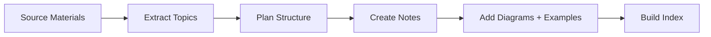

# Study Notes Creator

Transform source materials into organized, visual study notes with themed folders, rich diagrams, and example-based learning.

## Workflow



---

## Step 1: Understand the Source

1. **Read the source** - PDFs, lecture notes, existing docs
2. **Identify 5-8 main topics** - Major themes
3. **Find subtopics** - What falls under each theme?
4. **Note example opportunities** - Where can real examples help?

---

## Step 2: Plan Folder Structure

```
subject/
├── README.md                    # Master index
├── concepts/                    # Core theory
│   ├── 01-introduction.md
│   └── 02-fundamentals.md
├── techniques/                  # How-to procedures
│   ├── 01-method-a.md
│   └── 02-method-b.md
├── examples/                    # Worked problems
│   ├── 01-basic-examples.md
│   └── 02-advanced-examples.md
└── practice/                    # Exercises
    └── 01-exercises.md
```

---

## Step 3: Note Template

```markdown
# [Topic Title]

One sentence summary.

## Overview

[Mermaid diagram showing the main concept]

## Key Concepts

### Concept 1

Brief explanation.

**Example:**
[Concrete example with real-world scenario]

## Summary Table

| Term | Definition | Example |
|------|------------|---------|
| A | What A is | Real use case |

## Practice Problems

1. Problem statement
   <details>
   <summary>Solution</summary>
   Step-by-step solution
   </details>

## Related

- [[other-note]] - Connection
```

---

## Step 4-5: Diagrams (Mermaid primary, ASCII fallback)

Pick the diagram type from the content, then write it in Mermaid (fall back to ASCII box-drawing only where Mermaid can't render):

| Content type | Diagram |
|---|---|
| Process / sequence of steps | Mermaid `flowchart LR` |
| Hierarchy / taxonomy / tree | Mermaid `flowchart TB` |
| Interaction / message order over time | Mermaid `sequenceDiagram` |
| State machine / lifecycle | Mermaid `stateDiagram-v2` |
| Repeating loop / feedback cycle | Mermaid cycle (`flowchart` with a back-edge) |
| Chronology / milestones | Mermaid `timeline` |
| Concept map / brainstorm | Mermaid `mindmap` |
| Layered stack / architecture | ASCII box stack (└─┘ │ ─) when layers must align visually |

ASCII box chars: `┌ ┐ └ ┘  ─ │  ├ ┤ ┬ ┴  ▶ ▼ ◀ ▲`. Every note should carry at least one diagram.

> Boundary: this skill produces Obsidian-style study notes with diagrams. To turn transcripts/books into NotebookLM-ready study material, use `udemy-transcript-to-notebooklm` or `book-to-notebooklm` instead.

---

## Step 6: Example-Based Learning Patterns

### Pattern 1: Concept → Example → Variation

```markdown
## [Concept Name]

**Definition:** Brief explanation.

**Example:**
[Concrete, real-world scenario]

**Variation:**
What if [different condition]? → [Different outcome]
```

**Cross-discipline examples:**

| Subject | Concept | Example | Variation |
|---------|---------|---------|-----------|
| Biology | Osmosis | Red blood cells in salt water shrink | In pure water? → Cells swell |
| Economics | Supply/Demand | Oil price rises when OPEC cuts production | New oil discovered? → Price falls |
| Physics | Momentum | Bowling ball vs tennis ball at same speed | Same mass, different speed? |
| History | Cause/Effect | Industrial Revolution → urbanization | No steam engine? |

### Pattern 2: Problem → Solution → Explanation

```markdown
**Problem:** [Specific question]

**Solution:**
Step 1: [Action]
Step 2: [Action]
Result: [Answer]

**Why it works:** [Underlying principle]
```

### Pattern 3: Compare and Contrast

| Aspect | Topic A | Topic B |
|--------|---------|---------|
| Feature 1 | ... | ... |
| Feature 2 | ... | ... |

**Similarities:** Both...
**Key Difference:** A is... while B is...

---

## Step 7: Build the Index

```markdown
# [Subject Name]

Brief description.

## Quick Navigation

### 📚 Core Concepts
- [[concepts/01-topic|Topic Name]] - Brief description

### 🔧 Techniques/Methods
- [[techniques/01-method|Method Name]] - Brief description

### 💡 Examples
- [[examples/01-basic|Basic Examples]] - Start here

---

*Last updated: YYYY-MM-DD*
```

---

## Quality Checklist

- [ ] Every note has at least 1 Mermaid diagram
- [ ] Every concept has at least 1 concrete example
- [ ] Examples use real, relatable scenarios
- [ ] Folder structure is numbered for reading order
- [ ] README links to all notes
- [ ] Wikilinks connect related topics
