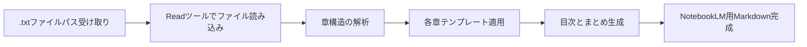
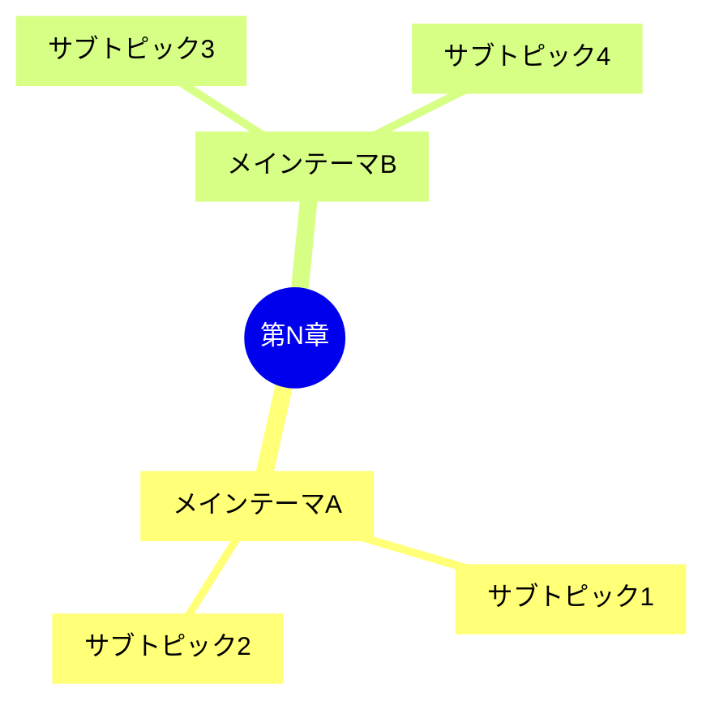

# Udemy Transcript → NotebookLM 学習用Markdown

Udemyの動画講義トランスクリプトを受け取り、NotebookLMでの復習・学習定着に最適化された構造化markdownを生成するスキル。

## 対象ユースケース

- Udemy講義のトランスクリプト（字幕テキスト）を整理・再構成したい
- NotebookLMへインポートして復習・Q&A生成に使いたい
- 各章ごとの学習ポイントを明確にしたい
- 試験対策や知識定着のための復習資料を作りたい

---

## ワークフロー全体像



---

## Step 1: .txtファイルの読み込みと確認

ユーザーが `.txt` ファイルのパスを指定したら、**Readツールで必ずファイルを読み込んでから**処理を開始する。

```
# ユーザーの指定例
/udemy-transcript-to-notebooklm transcript.txt
/udemy-transcript-to-notebooklm ~/Downloads/python_course.txt
/udemy-transcript-to-notebooklm  # ファイル未指定の場合はパスを聞く
```

ファイルを読み込んだら、以下を確認する:

1. **章立ての検出** - セクション番号、見出し、タイムスタンプを探す
2. **コース全体の把握** - 何を学ぶコースか、対象者は誰か
3. **章数と構成** - いくつの章・セクションがあるか

### 章立ての検出パターン

トランスクリプト内で以下のパターンを探す:

```
# 検出パターン例
- "セクション 1:", "Section 1:", "Chapter 1:"
- "第1章", "1章", "1. "
- タイムスタンプ付きの見出し: "[00:00:00] タイトル"
- 明示的な改行や区切り文字
- 講師の言葉: "このレクチャーでは〜", "次のセクションでは〜"
```

**章立てが不明瞭な場合**: トピックの変わり目を意味のある単位で推定し、ユーザーに確認を取る。

---

## Step 2: コース全体の概要セクション生成

最初に、コース全体の概要を作成する。

```markdown
# [コースタイトル]

> このドキュメントは [コース名] の学習用資料です。

## コース概要

**目的**: [このコースで何を学ぶか1〜2文]  
**対象者**: [誰向けか]  
**難易度**: [初級 / 中級 / 上級]  
**講師**: [名前があれば]

## 学習目標

このコースを通じて以下を習得できます:

- [ ] [目標1]
- [ ] [目標2]
- [ ] [目標3]

## 全体構成

| 章 | タイトル | 主な内容 |
|----|----------|----------|
| 第1章 | [タイトル] | [概要] |
| 第2章 | [タイトル] | [概要] |
| ... | ... | ... |

---
```

---

## Step 3: 各章のMarkdown生成（必須テンプレート）

**各章ごとに必ずこのテンプレートを適用する。章の順序と番号を厳守すること。**

````markdown
---

## 第N章: [章タイトル]

### 📌 章の概要

[この章で扱うトピックを2〜3文で要約。何を学び、なぜ重要かを明記する。]

### 🎯 学習目標

この章を終えると以下ができるようになります:

- [具体的なスキル・知識1]
- [具体的なスキル・知識2]
- [具体的なスキル・知識3]

### 📚 キーコンセプト

#### [コンセプト名1]

[定義・説明を簡潔に。専門用語は日本語で説明を追加。]

**ポイント:**
- [重要点A]
- [重要点B]

**具体例:**
> [トランスクリプト内の具体例、またはわかりやすい例示]

---

#### [コンセプト名2]

[定義・説明]

**ポイント:**
- [重要点]

**具体例:**
> [例]

---

### 🔑 重要用語・キーワード

| 用語 | 意味 | 関連コンセプト |
|------|------|----------------|
| [用語1] | [意味] | [関連] |
| [用語2] | [意味] | [関連] |
| [用語3] | [意味] | [関連] |

### 🗺️ コンセプトマップ



### 💡 重要ポイントまとめ

> **この章の核心**: [最も重要な1文]

1. **[ポイント1]**: [説明]
2. **[ポイント2]**: [説明]
3. **[ポイント3]**: [説明]

### ❓ 復習クイズ（NotebookLM向け）

NotebookLMにQ&Aを生成させるためのシードクエスチョン:

**Q1**: [この章の重要概念についての質問]  
<details>
<summary>A1 (クリックで確認)</summary>

[答え。トランスクリプトの内容に基づいて回答。]

</details>

---

**Q2**: [実践的な応用に関する質問]  
<details>
<summary>A2 (クリックで確認)</summary>

[答え]

</details>

---

**Q3**: [理解を深める概念的な質問]  
<details>
<summary>A3 (クリックで確認)</summary>

[答え]

</details>

### 🔗 前後の章との関係

- **前の章から**: [この章が前章をどう発展させるか]
- **次の章へ**: [この章が次章にどうつながるか]

---
````

---

## Step 4: コース全体のまとめセクション生成

最後に全体まとめを追加する。

```markdown
---

## 📖 コース全体まとめ

### 学んだこと総復習

| 章 | 核心メッセージ |
|----|----------------|
| 第1章 | [1文で核心] |
| 第2章 | [1文で核心] |
| ... | ... |

### 重要用語マスターリスト

| 用語 | 章 | 意味 |
|------|-----|------|
| [用語] | 第N章 | [意味] |
| ...   | ...  | ...  |

### 🎓 最終確認チェックリスト

コース修了後、以下の質問に答えられますか？

- [ ] [コース全体の核心知識を問う質問1]
- [ ] [コース全体の核心知識を問う質問2]
- [ ] [実践的な応用を問う質問3]
- [ ] [概念間の関係を問う質問4]

### 📝 NotebookLMへのインポート手順

1. このMarkdownファイルをNotebookLMにアップロード
2. 「ソースを追加」→「ファイルをアップロード」を選択
3. 章ごとに「質問」機能で各章の内容を深掘りする
4. 「音声概要」機能でポッドキャスト形式の復習音声を生成
5. 「学習ガイド」を生成して試験対策に活用
```

---

## 実行ルール（厳守事項）

### 章立ての遵守

1. **章の順序を変えない**: トランスクリプトの章構成を必ず維持する
2. **章番号を振る**: 明示されていない場合も通し番号を付与する
3. **章タイトルを使う**: 講師が付けたタイトルをそのまま使用する
4. **章をまたいでまとめない**: 複数章の内容を1つの章にまとめることは禁止
5. **省略しない**: トランスクリプトに内容があれば、すべての章を生成する

### コンテンツ品質

- **トランスクリプト忠実**: 講師の説明を改変せず要約する
- **例は具体的に**: 抽象的な説明には必ず具体例を追加
- **NotebookLM最適化**: Q&Aは文脈が自己完結するよう書く
- **日本語で統一**: 英語トランスクリプトの場合も日本語で出力
- **コードブロック使用**: コード、コマンド、設定値はコードブロックで囲む

### Mermaid図の使い分け

| 章の内容 | 推奨図の種類 |
|----------|-------------|
| プロセス・手順 | flowchart LR |
| 概念の関係性 | mindmap |
| 時系列・歴史 | timeline |
| 状態変化 | stateDiagram-v2 |
| 概念の階層 | flowchart TB |

---

## 処理開始時のユーザーへの質問

トランスクリプトを受け取ったら、生成前に以下を確認する（明確なら省略可）:

```
以下を確認させてください:

1. 出力言語: 日本語でよいですか？（デフォルト: はい）
2. 章の粒度: 各レクチャーを1章として扱いますか？それとも大セクション単位ですか？
3. Q&A数: 各章に何問のQ&Aを生成しますか？（デフォルト: 3問）
4. コード例の扱い: コードは全文含めますか？（デフォルト: 重要部分のみ）
5. 出力先: ファイルに書き出しますか？（デフォルト: チャットに出力）
```

---

## 出力ファイル名の規則

入力 `.txt` ファイルと同じディレクトリに出力する。ファイル名は入力ファイルのベース名に `_notebooklm` を付与する。

```bash
# 入力 → 出力
transcript.txt              → transcript_notebooklm.md
python_course.txt           → python_course_notebooklm.md
~/Downloads/aws_udemy.txt   → ~/Downloads/aws_udemy_notebooklm.md
```

---

## 処理例

### インプット例

ユーザーが `.txt` ファイルパスを渡す:

```
/udemy-transcript-to-notebooklm ~/Downloads/python_intro.txt
```

Readツールで読み込んだファイルの内容（例）:

```
Section 1: Introduction to Python
Welcome to this Python course. In this first section...
Python is a high-level, interpreted programming language...

Section 2: Variables and Data Types
Now let's talk about variables...
In Python, you don't need to declare variable types...
```

### アウトプット例（生成されるMarkdown）

```markdown
# Python入門コース - 学習ノート

## コース概要
...（省略）

---

## 第1章: Pythonの概要 (Introduction to Python)

### 📌 章の概要
この章ではPythonの基本的な特徴と、なぜPythonが多くの開発者に選ばれるかを学びます。

### 🎯 学習目標
- Pythonがどのような言語かを説明できる
- Pythonの主な用途を挙げられる

### 📚 キーコンセプト

#### 高水準インタープリタ言語としてのPython
Pythonは人間が読みやすい文法を持つ高水準言語で、実行時にコードを逐次解釈します。

**ポイント:**
- コンパイル不要で即実行可能
- 文法がシンプルで学習コストが低い

...（以下省略）
```

---

## NotebookLM活用のベストプラクティス

生成したMarkdownをNotebookLMで最大限活用するためのヒント:

1. **章ごとに質問する**: 「第3章のキーコンセプトを教えて」
2. **比較質問**: 「第2章と第4章の違いは？」
3. **音声概要**: 各章の音声サマリーを生成して通勤中に聴く
4. **学習ガイド生成**: 章ごとに自動生成される学習ガイドを試験対策に活用
5. **タイムライン**: 複数コースのノートを1つのNotebookに集約して横断検索
